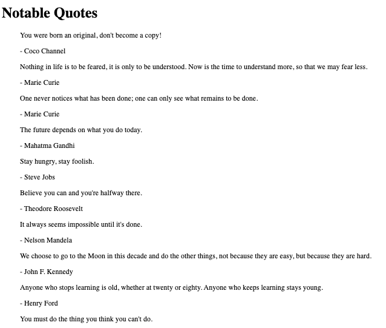
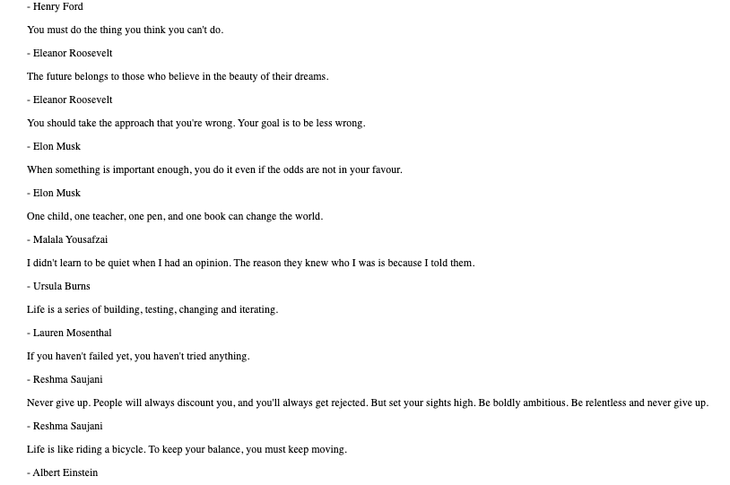
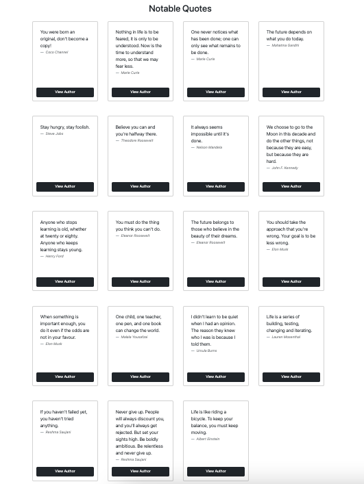

# Changelog

## Version-0.1 | Foundation |  10 July 2026

### User Features
- Homepage displaying notable quotes
- Quote database

### Engineering
- Django project setup
- Quote model
- JSON import command
- Duplicate detection during import
- Django Admin integration

## Version-0.2 | User Experience | 17 July 2026

Added:
- Bootstrap card-based quote layout
- Responsive quote grid
- Individual quote cards with improved typography
- Reusable template structure for quote presentation
- Improved homepage user interface

Changed:
- Replaced blockquote list with card-based layout
- Improved readability and visual presentation

