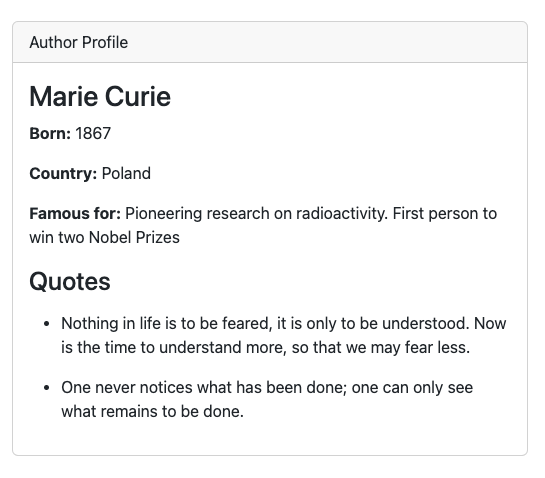
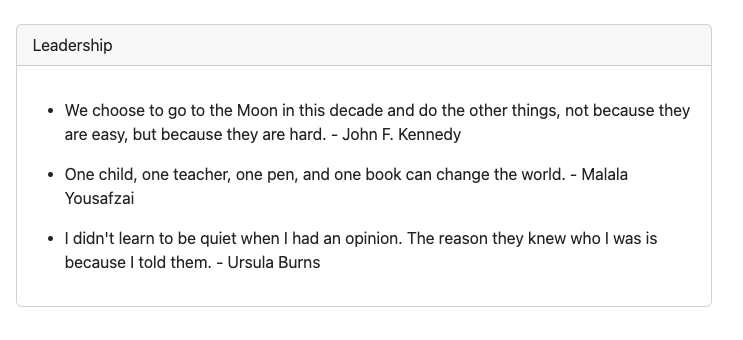
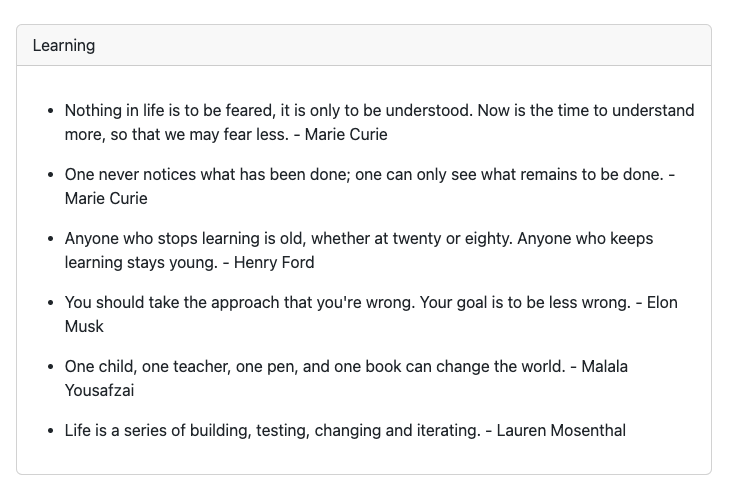
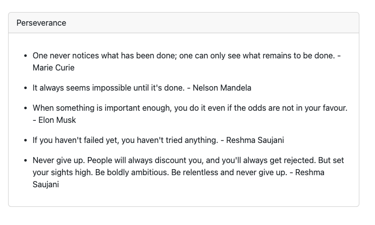
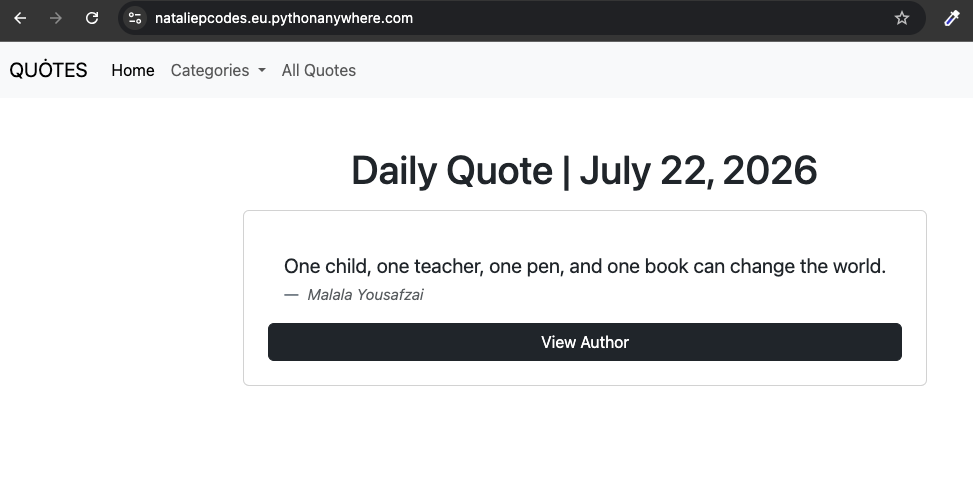
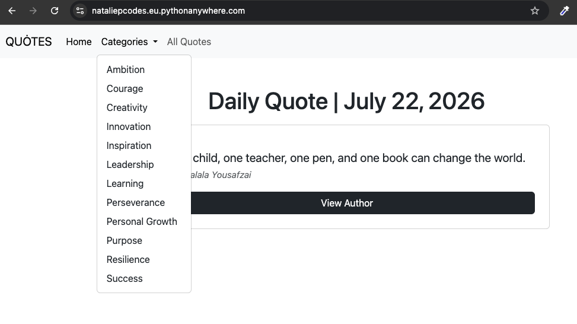
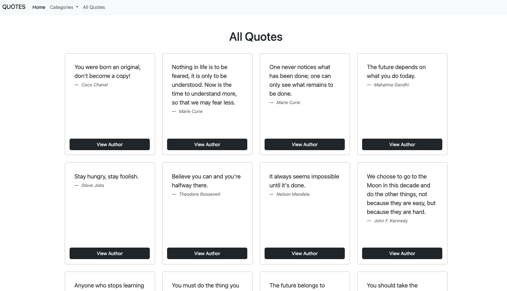
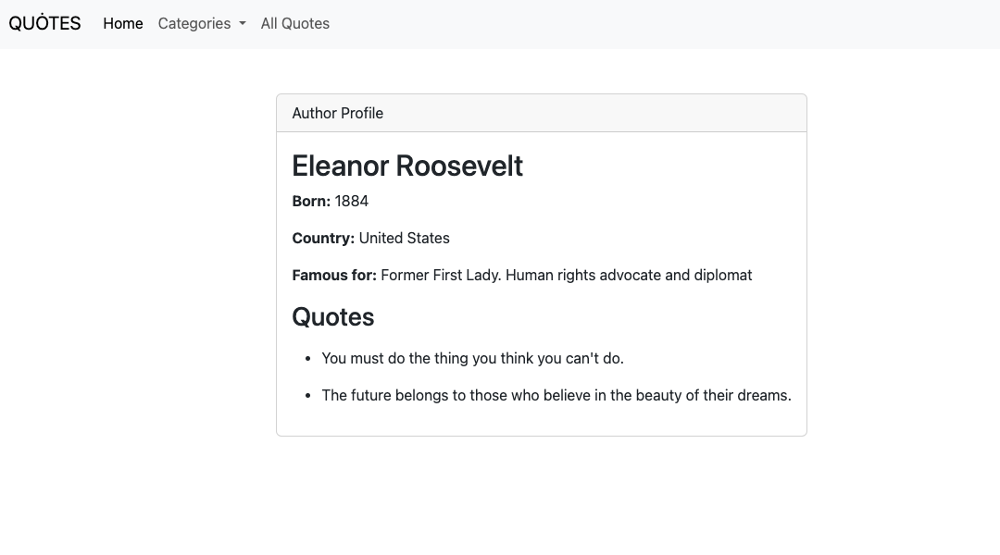

# Change Log

## Version-0.1 | Foundation |  10 July 2026

### User Features
- Homepage displaying notable quotes
- Quote database

### Engineering
- Django project setup
- Quote model
- JSON import command
- Duplicate detection during import
- Django Admin integration

## Version-0.2 | User Experience | 17 July 2026

Added:
- Bootstrap card-based quote layout
- Responsive quote grid
- Individual quote cards with improved typography
- Reusable template structure for quote presentation
- Improved homepage user interface

Changed:
- Replaced blockquote list with card-based layout
- Improved readability and visual presentation

## Version-0.3 | Author Profiles | 18 July 2026

### Author Profile Views

Added dedicated author profile pages displaying biographical information and a list of all quotes associated with each author.

This feature demonstrates Django model relationships, reverse lookups using `related_name`, and detail views for related objects.

### Database Design Notes

Version-0.3 introduced an Author model and changed Quote.author from text to a ForeignKey relationship.

This required separating author data from quote data and importing related objects before importing quotes.

## Version 0.4 | Categories and Quote Organisation | 20 July 2026

Version-0.4 introduced categories to allow quotes to be grouped and filtered by themes.

Changes:
- Added a Category model to separate category data from quote data
- Added a ManyToMany relationship between Quote and Category
- Created the quote-category join table automatically through Django migrations
- Added category loading through a custom management command
- Updated quote loading to assign categories to quotes during import
- Added category detail views to display quotes belonging to a selected category

### Database Design Notes

Categories use a ManyToMany relationship because:
- A quote can belong to multiple categories and a category can contain multiple quotes

Django manages the ManyToMany relationship through the automatic join table: notable_quotes_quote_category

## Version 1.0 | User Interface and Deployment | 22 July 2026

### Added
- Responsive Bootstrap navigation bar
- Daily Quote feature with current/today's date
- Dedicated All Quotes page
- Category dropdown navigation
- Public deployment to PythonAnywhere

### Changed
- Home page redesigned to feature the daily quote
- Quote collection moved to its own page
- Improved responsive layout using Bootstrap

### Security
- Moved Django SECRET_KEY to environment variables via python-dotenv

### Deployment
- Configured PythonAnywhere hosting
- Configured static files for production

